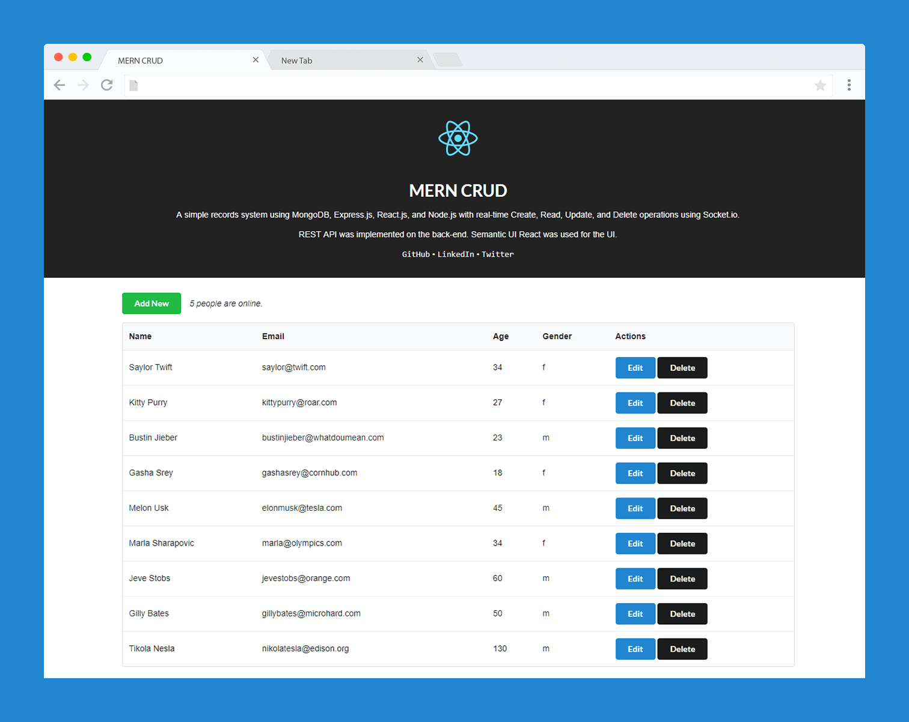

# MERN CRUD

A simple records system using MongoDB, Express.js, React.js, and Node.js with real-time Create, Read, Update, and Delete operations using Socket.io.

REST API was implemented on the back-end. Semantic UI React was used for the UI in the front-end.


Demo: [https://mern-crud-mpfr.onrender.com](https://mern-crud-mpfr.onrender.com)



## Support
[](https://github.com/cefjoeii)
[](https://github.com/cefjoeii/mern-crud)
[](https://github.com/cefjoeii/mern-crud/fork)
[](https://github.com/cefjoeii/mern-crud)

## Getting started

### Requirements

- Node.js 20 or later
- npm 10 or later
- MongoDB 7 or later for local development, or Docker Desktop

### Install

```bash
git clone https://github.com/<your-user-name>/mern-crud.git
cd mern-crud
npm ci
cd react-src
npm ci
cd ..
```

Copy `.env.example` to `.env` and update the values for your machine:

```bash
copy .env.example .env
```

On macOS or Linux, use `cp .env.example .env` instead.

### Back-end

Start MongoDB, then run the server from the repository root:

```bash
npm start
```

View [http://localhost:3000](http://localhost:3000) in a browser. The health endpoint is available at [http://localhost:3000/health](http://localhost:3000/health).

The REST API provides these endpoints:

| Method | Endpoint | Description |
| --- | --- | --- |
| `GET` | `/api/users` | List all users |
| `GET` | `/api/users/:id` | Get one user |
| `POST` | `/api/users` | Create a user |
| `PUT` | `/api/users/:id` | Update a user |
| `DELETE` | `/api/users/:id` | Delete a user |

### Front-end

Run the React development server from `react-src/`:

```bash
cd react-src
npm start
```

View [http://localhost:4200](http://localhost:4200) in a browser.

To create the production build served by Express:

```bash
npm run build
```

The build is written to the root `public/` directory.

### Docker

Docker Compose starts MongoDB, the API, and the React development server:

```bash
docker-compose up
```

The web application is available at [http://localhost:4200](http://localhost:4200).

## Testing and quality checks

Run backend tests for the health endpoint and user CRUD behavior:

```bash
npm test
```

Run backend linting:

```bash
npm run lint
```

Run frontend tests:

```bash
cd react-src
npm test -- --watchAll=false --runInBand
```

The workflow in `.github/workflows/ci.yml` runs backend linting, backend tests, frontend tests, and the production build for pushes and pull requests.

## Project structure

```text
config/       Environment-backed server configuration
models/       Mongoose data models
routes/       Express API routes
tests/        Backend endpoint tests
react-src/    Editable React application
public/       Production React build served by Express
```

The `public/` directory is generated by `npm run build` from `react-src/`. Edit the source in `react-src/` and rebuild instead of changing hashed files in `public/static/` manually.

## Contribute
Feel free to help out as I may have other work/life commitments. See [CONTRIBUTING.md](CONTRIBUTING.md).

## To Do

- [x] Create
- [x] Read
- [x] Update
- [x] Delete
- [x] Real-time broadcast using Socket.io
- [x] Deploy in Heroku
- [x] Front-end validation (HTML)
- [x] Unit Tests

## License
**MERN CRUD** is available under the **MIT** license. See the [LICENSE](LICENSE) file for more info.
